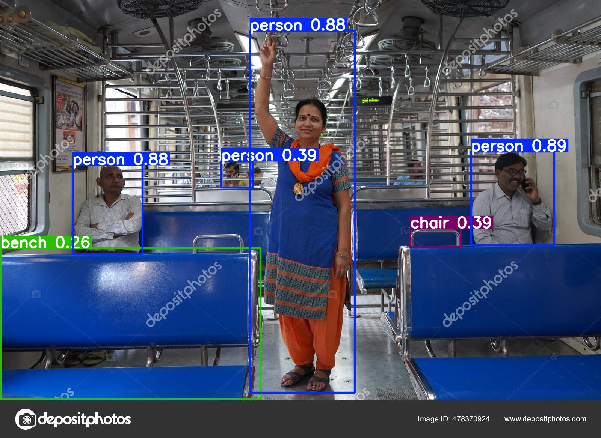

# 🚆 Mumbai Local Train Coach Crowd Estimator

This project tackles the issue of **overcrowding in Mumbai local trains** by providing **coach-level crowd estimation** using **computer vision**.  
It combines **YOLOv8 for detection**, a **Flask backend with simulation**, and a **web-based frontend** to display results with a simple **traffic-light system** (Green, Yellow, Red).

---

## ✨ Features

- 🟢 **Coach-level occupancy detection** (Safe, Moderate, Overcrowded).  
- 🤖 **YOLOv8-based detection results** integrated into a live simulation.  
- 🌐 **Flask backend** for simulated real-time train data.  
- 💻 **Frontend** built with HTML, CSS, JS to visualize results.  
- 📊 **Color-coded UI** for easy interpretation:  
  - 🟢 Green = Safe  
  - 🟡 Yellow = Moderate  
  - 🔴 Red = Overcrowded  

---

## 🧠 Model

- **Model Used:** YOLOv8 (`person` class).  
- **Why YOLOv8?**  
  - Real-time capability  
  - Accurate for passenger detection  
  - Lightweight and easy integration with backend + frontend  

### Occupancy Classification Rules:

- 🟢 **Green**: <30% occupancy (Safe)  
- 🟡 **Yellow**: 30–70% occupancy (Moderate)  
- 🔴 **Red**: >70% occupancy (Overcrowded)  

---

## 📂 Dataset

- **Size:** 64+ sample images of train compartments (empty, moderate, crowded)  
- **Source:** Public online datasets + simulated samples  
- **Limitations:** Prototype-level dataset (varied quality, limited samples)  
- **Future Plan:** Collect Mumbai-specific datasets with real conditions  

---

## ⚙️ System Workflow

1. **YOLOv8** detects passengers → stores counts in `results.json`  
2. `simulate_crowd.py` maps detections into `train_data.json` (auto-updates every 30s)  
3. **Flask backend** (`app.py`) serves JSON to the frontend  
4. **Frontend** (`index.html`, `style.css`, `script.js`) displays train and coach occupancy using color codes  

📌 **System Architecture Diagram**  
*(Add to `screenshots/system_architecture.png`)*  

---

## 📂 Project Structure
```bash
Mumbai_Local_Crowd_Detection_Project/
│
├── backend/
│ ├── app.py # Flask backend server
│ ├── simulate_crowd.py # Simulation script (updates JSON every 30s)
│ ├── train_data.json # Live train data
│ └── results.json # YOLO detection results
│
├── frontend/
│ ├── index.html
│ ├── style.css
│ └── script.js
│
├── crowd_dataset/ # Dataset images
├── detection/ # YOLO model/detection code
├── annotated_results/ # YOLO annotated results
└── screenshots/ # 📸 Project screenshots (UI + architecture)
```

---

## 📸 Screenshots

*(Put screenshots inside the `screenshots/` folder)*

- **Train Search UI**  
  

- **Search Results UI**   
  

- **Coach Occupancy Visualization**  
  

- **Live Update of Results**    
  

- **Annotated Result Example 1**  
  

- **Annotated Result Example 2**  
  

---

## ▶️ Running the Project

### 1️⃣ Run Simulation

```bash
cd backend
python simulate_crowd.py
```
- ✅ Updates train_data.json every 30 seconds
- ✅ Prints updated train_data.json in the terminal after each cycle


### 💻 2. Run Backend

```bash
cd backend
python app.py
```
🌐 Server starts at: http://127.0.0.1:5000


### 🌐 3. Open Frontend

Open your browser and go to 👉 [`http://127.0.0.1:5000`](http://127.0.0.1:5000)


#### 📝 Steps

- 🔍 **Enter Source & Destination**
- 🚆 **Click on a Train**
- 👥 **View Coach Crowd Levels** — displayed using a color-coded system:
  - 🟢 **Green** = Safe  
  - 🟡 **Yellow** = Moderate  
  - 🔴 **Red** = Overcrowded

---

## 🚀 Future Improvements

- 📸 Expand dataset with real Mumbai train images  
- 🎥 Integrate with live CCTV feeds  
- ☁️ Deploy to cloud platforms (Heroku, Render, etc.)  
- 📱 Add mobile app support for commuters  
- 🛡️ Improve privacy (e.g., automatic face blurring in detection)

---

## 🧑‍💻 Contributors

- 👩‍💻 [@Mitali2425](https://github.com/Mitali2425)  
- 👩‍💻 [@Purvjadh](https://github.com/Purvjadh/)
- 👩‍💻 [@Eepsita12](https://github.com/Eepsita12)
- 👩‍💻 [@iram-a](https://github.com/iram-a)

---

## 📜 License

This project is for **academic purposes only**.  
Future production use must comply with:

- ⚖️ **Data Privacy Laws**  
- 🚉 **Indian Railway Regulations**

---
